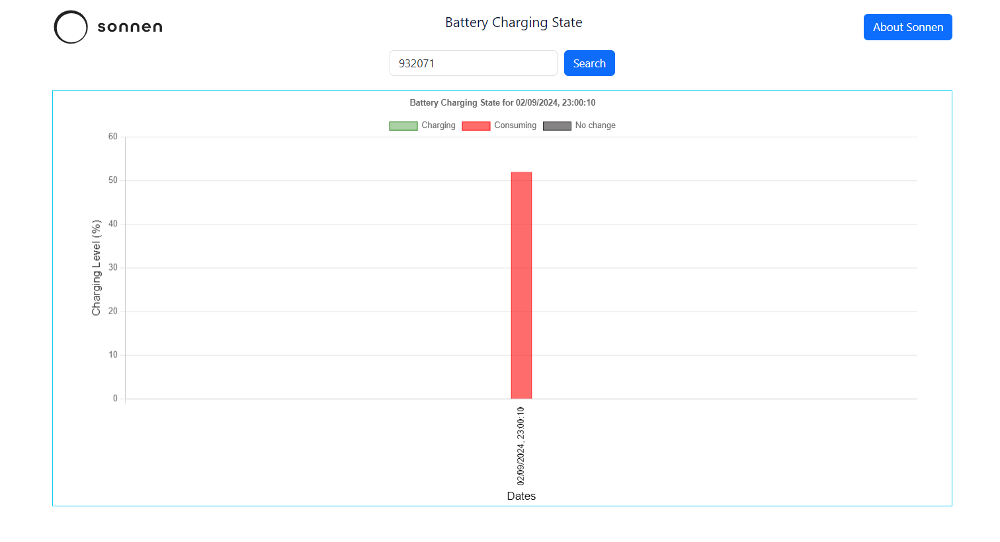

# Battery Status Visualization Project

This project visualizes battery charging and consumption data over a specified time range using React, Typescript and Chart.js. The project fetches mock battery data and provides a visual representation through a dynamic bar chart.

## Table of Contents

- [Features](#features)
- [Installation](#installation)
- [Screenshots](#screenshots)
- [API Endpoints](#api-endpoints)
- [Technologies Used](#technologies-used)
- [Folder Structure](#folder-structure)

---

## Features

- Visualize battery charging and consumption using dynamic bar charts.
- Search functionality to view charging information based on interval event ID.
- Real-time data fetching with mock API integration, you can change the data of src/store/backend-response.json.
- Interactive tooltip when hover on each bar to see the decreasing/incresing value.
- you can also see charging, consumption or no change bars on when click on label tags.

## Installation

Follow these steps to set up the project locally:

1. Clone the repository:

   ```bash
   git clone https://github.com/mariemashrafkamel/battery-status

2. Install the project:

   ```bash
   cd battery-status
   npm install
   npm run dev

---
## Screenshots

   
   
   

---

## API Endpoints
  - The project uses a mock API that simulates battery data fetching, in src/store/backend-response.json
  
---

## Technologies Used
   React, Typescript and Chart.js

---

## Folder Structure

  battery-status/
  ├── screenshots/            # Project screenshots
  ├── src/                    # Application source code
  │   ├── components/         # Components(HeaderComponent, BatteryBarChartComponent)
  │   ├── store/              # Store for API and mock data (battery.ts, backend-response.json)
  │   ├── App.tsx             # Main application component
  │   └── main.tsx            # Entry point for React
  │   └── interfaces.d.ts     # All Interfaces for project
  │   └── App.css             # Style sheet
  ├── .gitignore              # Ignored files for Git
  ├── README.md               # Project documentation
  ├── package.json            # Node dependencies and scripts
  └── tsconfig.json           # TypeScript configuration